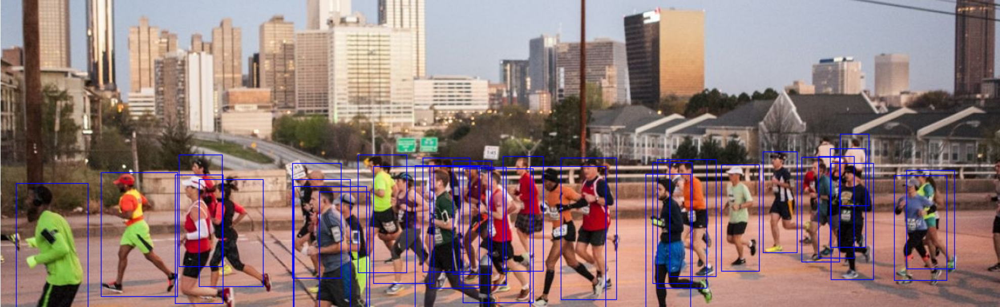

## A One-stage Crowd ObjectDetection



This project aims to reproduce the YOLO series via pytorch

#### Environment Setting
- Base Enviroment
```
pip install -r requirments.txt
```
- Pytorch Install

    check https://pytorch.org/get-started/locally/ for pytorch install


- odcore Install (Providing training, evaluating, inferencing, etc backend)
  
  https://github.com/NuayHL/odcore

  Note: This is my private Repo
```
git clone https://github.com/NuayHL/odcore.git
```

#### Simple Inferencing 
- Downloading Model Weight: YOLOv3_640.pth

    https://drive.google.com/file/d/1-y_pMTb3lMLTr4Clw2TTQ5pYi_g--WeP/view?usp=sharing


- Infer through following command
```
python infer.py --ckpt-file YOLOv3_640.pth --conf-file cfgs/yolov3 --img imgs/val_1.png
```
- Replace the image name to infer other images

#### Model Training

- Download **CrowdHuman** dataset
    
    https://www.crowdhuman.org/


- Rearrange the dataset as following structure
```
CrowdDetection
      |--CrowdHuman
            |--Images_train
            |      |-- All training images
            |--Images_val    
            |      |-- All val images
            |--annotation_train.odgt
            |--annotation_val.odgt
```
- Run `utility/tran_CrowdHuman.py` at root path
- Run command
  
    `python train.py --conf-file cfgs/yolov3 --batch-size 32 --workers 8 --device 0`
#### Model Evaluation

- CrowdHuman dataset required ! 
```
python eval.py --conf-file cfgs/yolov3 --ckpt-file YOLOv3_640.pth --workers 8 --batch-size 32 --device 0 
```
- Replace the --ckpt-file to other .pth files to evaluate them

#### Loss visualization
```
python drawloss.py --loss-log exp_loss.log
```
- Replace the --loss-log to other _loss.log files to visualize them


*Copyright© NuayHL 2022. All right reserved*
